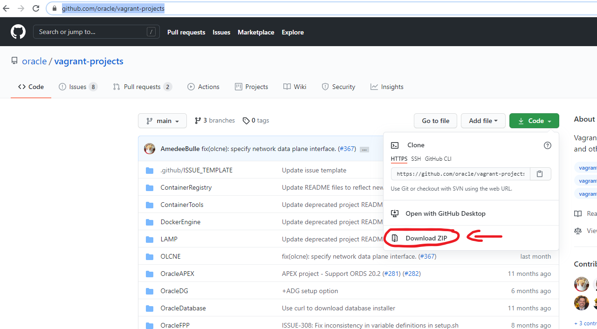

# Procedimentos de contigência e alta disponiblidade

O objetivo deste repositório é apresentar técnicas de contigência e alta disponibilidade. Fique a vontade de submeter melhorias em issues ou até copiar o procedimento (apenas mencione a fonte!)

<a name="#top">Menu:</a>

1. [ Pré-requisitos ](#1)
2. [ Configurações básicas ](#2)
3. [ Vagrant ](#3)
4. [ IaC: LAMP ] (#4)
5. 
6. 
7. 
8. 
9. 
10. 

# 1. Pré-requisitos

Para realização desta atividade, você precisará de um computador:

## Sistema Operacional:
- Windows
- Linux
- MacOS

## Espaço livre:
Depende da atividade escolhida:
- Cluster Oracle RAC: 150 GB espaço livre (ideal, contando download dos binários).

## Downloads
Para esta atividade utilizaremos o Virtualbox como virtualizador e o Vagrant como orquestrador. Estes downloads deverão ser realizados respectivamentes no seu computador origem.

Link para download: [Virtualbox](https://www.virtualbox.org/wiki/Downloads "VirtualBox - Download")
[Vagrant](https://www.vagrantup.com/downloads "Vagrant - Download")
[Opcional: GIT](https://git-scm.com/book/en/v2/Getting-Started-Installing-Git "Git - Download")

Caso você não faça o download do GIT, baixe o repositório base oficial da Oracle: https://github.com/oracle/vagrant-projects
Um exemplo de como voê pode baixar a partir do seu navegador:

Além disso para as atividades que vamso realizar nos próximos pontos, faça o download dos binários para fazer executar o passo a passo que você irá executar (aqui descreverei os links de referência mas o download deve ser apropriado para o Sistema operacional das suas máquinas virtuais:

- [Oracle Database](https://www.oracle.com/database/technologies/oracle-database-software-downloads.html "Oracle Database - Download"): Caso você queira fazer a tarefa para procedimentos de banco de dados Oracle
- [hammerDB](https://hammerdb.com/download.html "HammerDB - Download"): Para teste de carga.

# 2. Configurações básicas

a) Realize o clone do repositório ou descompacte o download do repositório do git (passo 1 tem uma imagem como fazer download).
comando para clonar caso tenha instalado o git:
git clone https://github.com/oracle/vagrant-projects

Obs. faça

Change into the vagrant-projects/OracleLinux/7 directory
Run vagrant status to check Vagrantfile status and possible plugin(s) required
Run vagrant up
The first time you run this it will provision everything and may take a while. Ensure you have a good internet connection!
The Vagrant file allows for customization.
SSH into the VM either by using vagrant ssh If required, by Vagrantfile you can also setup ssh port forwarding.
You can shut down the VM via the usual vagrant halt and the start it up again via vagrant up.

# 3. Vagrant

Aqui deixo uma referência de comandos básicos de vagrant. Caso queira se aprofundar, utilize o link: [Vagrant-Documentação Oficial](https://www.vagrantup.com/docs "Vagrant - Documentação oficial")

Comando a ser utilizado no prompt | Utilidade
------------ | -------------
vagrant init | inicializa processos do vagrant no sistema operacional hospedeiro. Deve ser utilizado apenas na primeira instalação
vagrant up | executa código para criação das suas VMs ou inicia sua infra-estrutura, caso ela esteja criada
vagrant destroy | apaga todas suas VMs contidas no código que foi executado
vagrant halt | realiza o desligamento de toda a sua infraestrutura provisionada como código.
vagrant ssh | para acessar a máquina virtual. Pode ser combinada com o nome do servidor, exemplo: vagrant ssh ol7-vagrant (observação se na sua máquina hospedeira você utiliza windows, utilize "set VAGRANT_PREFER_SYSTEM_BIN=0" antes do comando vagrant ssh para forçar a utilização de ssh, nao rsync)

