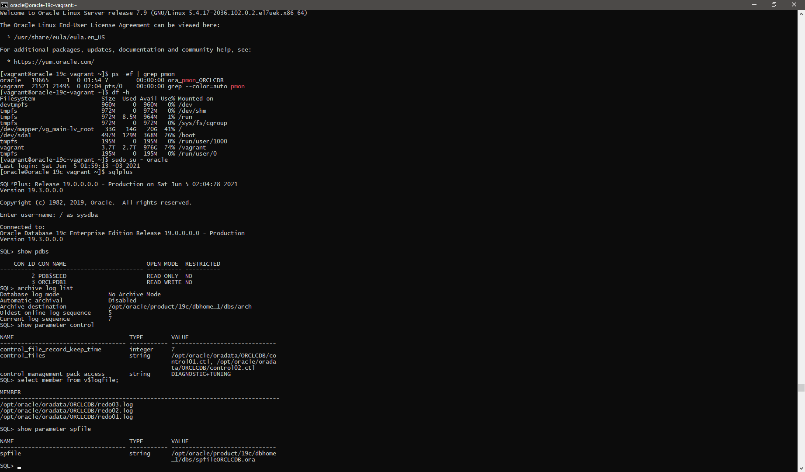

# Procedimentos de contingência e alta disponibilidade

O objetivo deste repositório é apresentar técnicas de contigência e alta disponibilidade. Fique a vontade de submeter melhorias em issues ou até copiar o procedimento (apenas mencione a fonte!)

<a name="#top">Menu:</a>

1. [ Pré-requisitos ](#1)
2. [ Configurações básicas ](#2)
3. [ Vagrant ](#3)
4. [ Linux ](#4)
5. [ LAMP ](#5)
6. [ Load Balancer ](#6)
7. [ Oracle Database: single instance ](#7)
8. [ Oracle Database: Data Guard ](#8)
9. [ Oracle Database: RAC ](#9)
10. [ Microservices, Serverless, Cloud ](#10)

<a name="1"></a>
# 1. Pré-requisitos

Para realização desta atividade, você precisará de acesso a internet (de preferencia em um computador sem VPN ou proxy - faremos muitos downloads via internet durante a montagem de máquinas virtuais - caso for o caso - ou acesso a cloud) e um computador:

## Sistema Operacional:
- Windows
- Linux
- MacOS

## Infraestrutura:
Depende da atividade escolhida:
- LAMP: 4 Gb de espaço livre em disco + 1 GB de RAM.
- Load Balancer: 10 Gb de espaço livre em disco + 4 GB de RAM.
- Oracle Single Instance: 15 GB de espaço livre em disco + 2 GB de RAM
- Cluster Oracle RAC: 150 GB espaço livre em disco (ideal, contando download dos binários). Minimo de 16 Gb de RAM para este laboratório.

## Downloads
Para esta atividade utilizaremos o Virtualbox como virtualizador e o Vagrant como orquestrador. Estes downloads deverão ser realizados respectivamentes no seu computador origem.

Link para download: [Virtualbox](https://www.virtualbox.org/wiki/Downloads "VirtualBox - Download")
[Vagrant](https://www.vagrantup.com/downloads "Vagrant - Download")
[Opcional: GIT](https://git-scm.com/book/en/v2/Getting-Started-Installing-Git "Git - Download")

Caso você não faça o download do GIT, baixe o repositório base oficial da Oracle: https://github.com/oracle/vagrant-projects
Um exemplo de como voê pode baixar a partir do seu navegador:


Além disso para as atividades que vamso realizar nos próximos pontos, faça o download dos binários para fazer executar o passo a passo que você irá executar (aqui descreverei os links de referência mas o download deve ser apropriado para o Sistema operacional das suas máquinas virtuais:

- [Oracle Database](https://www.oracle.com/database/technologies/oracle-database-software-downloads.html "Oracle Database - Download"): Caso você queira fazer a tarefa para procedimentos de banco de dados Oracle
- [hammerDB](https://hammerdb.com/download.html "HammerDB - Download"): Para teste de carga.

## Instalação
Deverá ser instalado apenas o que for da sua máquina hospedeira (onde ficarão as VMs), ou seja:

- Virtualbox

- Vagrant

- (Opcional) Git. Caso não queira fazer a instalação do GIT, você pode fazer o download do repositório somente

Os demais binários baixados estarão presentes nas máquinas virtuais criadas.

<!-- blank line -->
----
<!-- blank line -->

[ Retornar para o menu ](#top)

<a name="2"></a>
# 2. Configurações básicas

a) Realize o clone do repositório ou descompacte o download do repositório do git (passo 1 tem uma imagem como fazer download).
comando para clonar caso tenha instalado o git:
git clone https://github.com/oracle/vagrant-projects

Obs. faça o download ou clone do repositório.

b) O próximo passo é para ir ao diretório de cada uma das atividades. Antes de começar quaisquer atividade será mencionado o diretório que você deverá ir. Apenas para a primeira atividade de ambientação do vagrant criaremos uma infraestrutura basica com alguns conceitos.

c) (opcional) caso você deseje alterar as configurações básicas do Virtualbox:


Como área padrão para criação de vms, dentro do Virtualbox:


<!-- blank line -->
----
<!-- blank line -->

[ Retornar para o menu ](#top)

<a name="3"></a>
# 3. Vagrant

Aqui deixo uma referência de comandos básicos de vagrant. Estes comandos são executados no prompt de comando de sua preferencia (ms-dos, powershell, WSL, prompt de comando do MacOS, etc).

. Caso queira se aprofundar, utilize o link: [Vagrant-Documentação Oficial](https://www.vagrantup.com/docs "Vagrant - Documentação oficial")

Comando a ser utilizado no prompt | Utilidade
------------ | -------------
vagrant init | inicializa processos do vagrant no sistema operacional hospedeiro. Deve ser utilizado apenas na primeira instalação
vagrant up | executa código para criação das suas VMs ou inicia sua infra-estrutura, caso ela esteja criada
vagrant destroy | apaga todas suas VMs contidas no código que foi executado
vagrant halt | realiza o desligamento de toda a sua infraestrutura provisionada como código.
vagrant ssh | para acessar a máquina virtual. Pode ser combinada com o nome do servidor, exemplo: vagrant ssh ol7-vagrant (observação se na sua máquina hospedeira você utiliza windows, utilize "set VAGRANT_PREFER_SYSTEM_BIN=0" antes do comando vagrant ssh para forçar a utilização de ssh, nao rsync)
vagrant plugin install | para instalação de plugins no vagrant
vagrant status | Para saber o status da sua maquina virtual ou stack
vagrant global-status | Para saber o status de todas as máquinas virtuais provisionadas

Após a instalação do Vagrant é interessante baixar o pack de extensão de servidores guest do VirtualBox, assim suas máquinas virtuais já estarão com as boas práticas aplicadas:
```
vagrant plugin install vagrant-vbguest
```
Além disso, em todas as atividades onde o Vagrant for utilizado adicione a linha abaixo no Vagrantfile. Essa linha adicionará a sua máquina virtual um device optico para utilizar a iso da pack de extensão do Virtualbox:

```
## add optical Driver
  config.vm.provider "virtualbox" do |vb|
     
  vb.customize ["storageattach", :id, 
                "--storagectl", "IDE Controller", 
                "--port", "0", "--device", "1", 
                "--type", "dvddrive", 
                "--medium", "emptydrive"]    
  end  

```


<!-- blank line -->
----
<!-- blank line -->

[ Retornar para o menu ](#top)

<a name="4"></a>
# 4. Linux

Nesta sessão relaciono os comandos básicos de sistema operacional Linux.

Comando a ser utilizado no prompt | Utilidade
------------ | -------------
ssh <servidor> | acessa o servidor
vi <arquivo> | edita/visualiza o arquivo
netstat | visualiza os processos que estão com portas ativas no sistema operacional
systemctl reload <processo> | reinicia o processo no SO
systemctl status <processo> | mostra status no SO
ps -ef | visualiza lista de processos ativos no SO
sudo su - | permite que o usuário tenha privilégios administrativos


<!-- blank line -->
----
<!-- blank line -->

[ Retornar para o menu ](#top)
  
<a name="5"></a>
# 5. LAMP

O objetivo desta atividade é provisionar um ambiente com LAMP e realizar alguns backups da camada de aplicação e banco de dados.

Vá para o diretório da descompactado vagrant-projects/OracleLinux/7

a) crie um diretório que hospederá o código da sua infraestrutura com um arquivo chamado vagrantfile
```
tutorial-lamp
|__ Vagrantfile
```
Obs. os servidores virtuais serão criados no diretório padrão. Caso necessário altere.

b) Adicione o código abaixo ao seu vagrantfile:
 
```
Vagrant.configure("2") do |config|

  config.vm.define "lamp" do |lamp|
    lamp.vm.box = 'chrislentz/trusty64-lamp'
    lamp.vm.hostname = "lamp"
    lamp.vm.network :private_network, ip: "192.168.90.10"
    lamp.vm.network "forwarded_port", guest: 80, host: 3000
    lamp.vm.network "forwarded_port", guest: 8404, host: 8404
  end
end
```

Execute o "vagrant up" dentro do diretório com o vagrant file. Esta ação provisionará 1 máquinas virtuais (ou VM - Virtual Machine) e levará cerca de 10 min (o tempo depende da máquina host com 1 Gb de RAM e 40 GB de espaço virtual.
  
Como próximo passo, vamos acessar VM app-1 via comando "vagrant ssh lamp" para configurar uma página persoalizada. Dentro da VM, digite para subir os privilégios de administrador:
```
sudo su -
```

Após isso personalize a pagina:
```
cd /var/www/html/public
rm *.html
wget https://raw.githubusercontent.com/erikanagamine/altadispcontigencia-maa-portugues/main/images/index.html
```
Após tudo configurado, faça o teste de HTTP no seu browser para os IPs http://192.168.90.10. Perceba que seu servidor foi configurado. Neste momento o apache está respondendo na porta 80 para você. Suponha que essa seja a página frontend da sua aplicação.
  
e o banco de dados? neste caso esse servidor já contem uma instalação de MySQL. Vamos acessar o MySQL (verifique antes se você está com o root, caso contrário use o "sudo su -"):
```
mysql -uroot -p  
```
Ele irá te pedir a senha que é "password". Insira a senha.

Vamos verificar quais databases existem neste mysql, com o comando show databases;


Perceba que há 4 databases. Vamos utilizar o database dev neste exemplo. Para utilizado digite no mysql:

```
use dev;
```
Verifique quais tabelas este banco de dados tem com o comando "show tables":
```
show tables
```

Perceba que esse banco está sem dados. Vamos restaurar um database de exemplo. Saia do mysql com o comando "exit" e volte para o prompt de comando como root e vá para o diretório /tmp:
```
cd /tmp/
```
no diretório /tmp, vamos fazer o download de um database de teste:
```
wget https://github.com/datacharmer/test_db/archive/refs/heads/master.zip
```
Descompacte o arquivo zip, com o comando zip (este database de exemplo está disponivel em [Github oficial](https://github.com/datacharmer/test_db "Mysql database de exemplo"):
```
unzip https://github.com/datacharmer/test_db/archive/refs/heads/master.zip
```
Obs: caso o unzip não esteja instalado, use o comando abaixo para instalar o pacote e repita a operação:
```
apt-get update -y;
apt-get install unzip
```
Entre no diretório test_db-master:
```
cd test_db-master
```
Restaure o database de exemplo com o comando "mysql -p"
```
mysql -p < employees.sql
```
                        
                        
Teste o restore do database com os comandos abaixo:
```
mysql -uroot -p -t < test_employees_md5.sql
mysql -uroot -p -t < test_employees_sha.sql
```                     
Conecte novamente no mysql e verifique que agora temos 5 databases ao invés de 4. vamos explorar mais o database de 'employees':
```
use employees
```
verifique a quantidade de registros da tabela salaries:
```
select count(1) from salaries;
```
Crie objetos e insira dados para serem contemplados em nosso backup:
```
CREATE TABLE Persons (
    PersonID int,
    LastName varchar(255),
    FirstName varchar(255),
    Address varchar(255),
    City varchar(255)
);
 
Insert into Persons
values
(1,'Silva', 'Joao', 'Rua do paraiso 20','Sao Paulo');

Insert into Persons
values
(2,'Silva', 'Maria', 'Rua do paz 80','Sao Paulo');
                                           
```                                           
                                           
Vamos fazer nosso primeiro backup no mysql:

```
mysqldump -p employees > employees_full.dmp
  
```
                                           
apague o database employees:
```
mysql -uroot -p
  
drop database employees;
```   
Restaure as informações do database employee:


```
mysql -p employees < employees_full.dmp
  
```
Verifique se os dados foram recuperados com sucesso, realizando uma consulta na tabela Persons:
```
select count(1) from Persons;
```


<!-- blank line -->
----
<!-- blank line -->

[ Retornar para o menu ](#top)

<a name="6"></a>
# 6. Load Balancer
Nesta atividade criaremos todas as instancias de load balancer manualmente com intuito de se ambientar com o vagrant e o conceito de load balancer. Iremos utilizar o software opensource chamado HaProxy que será instalado dentro das máquinas virtuais. Para saber mais sobre o HAProxy, visite o site [HAProxy-Documentação Oficial](http://www.haproxy.org/ "HAProxy - site oficial")

No vagrant o principal arquivo é o vagrantfile que conterá os comandos da infraestrutura que você deseja provisionar.

Nesta atividade executaremos uma atividade semelhante a sugerida no site [Referencia](https://medium.com/@deryrahman/haproxy-load-balancer-with-vagrant-5820a6eb8d06 "HAProxy - site oficial") e abaixo:


a) crie um diretório que hospederá o código da sua infraestrutura com um arquivo chamado vagrantfile
```
tutorial-haproxy
|__ Vagrantfile
```
Obs. os servidores virtuais serão criados no diretório padrão. Caso necessário altere.

b) Adicione o código abaixo ao seu vagrantfile:
  
```
# vi: set ft=ruby :

n = 2 ## coloque aqui o numero de servidores que você terá de loadbalancer

Vagrant.configure("2") do |config|

  config.vm.define "loadbalancer" do |loadbalancer|
    loadbalancer.vm.box = 'ubuntu/bionic64'
    loadbalancer.vm.hostname = "loadbalancer"
    loadbalancer.vm.network :private_network, ip: "192.168.10.10"
    loadbalancer.vm.network "forwarded_port", guest: 80, host: 3000
    loadbalancer.vm.network "forwarded_port", guest: 8404, host: 8404
  end
  
  n.times do |i|
    config.vm.define "app-#{i+1}" do |app|
      app.vm.box = 'chrislentz/trusty64-lamp'
      app.vm.hostname = "app-#{i+1}"
      app.vm.network :private_network, ip: "192.168.10.#{10+i+1}"
    end
  end
end
```

Execute o "vagrant up" dentro do diretório com o vagrant file. Esta ação provisionará 3 máquinas virtuais (ou VM - Virtual Machine) e levará cerca de 20 min (o tempo depende da máquina host. Cada VM tem 1 Gb de RAM e 40 GB de espaço virtual.
  
Como próximo passo, vamos acessar VM app-1 via comando "vagrant ssh app-1" para configurar uma página persoalizada. Dentro da VM, digite para subir os privilégios de administrador:
```
sudo su -
```
Após isso personalize a pagina:
```
cd /var/www/html/public
rm *.html
wget https://raw.githubusercontent.com/erikanagamine/altadispcontigencia-maa-portugues/main/images/index.html

```
Saia do servidor app-1 com o comando "exit" e repita o processo  para o servidor 2.

Após tudo configurado, faça o teste de HTTP no seu browser para os IPs http://192.168.10.11 e http://192.168.10.12

Após o provisionamento, acesse a máquina virtual do load balancer com o comando "vagrant ssh loadbalancer" para instalarmos o HAProxy:

```
sudo apt -y install haproxy
```
Dentro da VM do loadbalancer ainda, edite o arquivo de configuração /etc/haproxy/haproxy.cfg para apontar para os backend/frontend set e alimentar as estatisticas do proxy

Comando para acessar o editor do arquivo:
```
sudo vi /etc/haproxy/haproxy.cfg
```
Edição do haproxy.cfg
```
backend apps
  server app1 192.168.10.11:80 check
  server app2 192.168.10.12:80 check

frontend main
  bind *:80
  use_backend apps

listen stats
  bind *:8404
  stats enable
  stats uri /monitor
  
```

Salve as configurações do arquivo e faça o reload do processo do haproxy:
```
sudo systemctl reload haproxy
```

Saia da máquina virtual do loadbalancer e no seu computador visite o site: http://192.168.10.10 (servidor do load balancer). Deverá aparecer a página de um dos servidores de aplicação. Com isso a configuração está concluida. Vamos fazer o teste baixando um dos servidores (perceba no rodapé da página qual dos servidores está sendo responsivel pela pagina e execute o comando halt no vagrant "vagrant halt app-1".
  
Perceba que o servidor foi baixado e automaticamente o servidor de loadbalancer passará a responder pelo servidor app-2 e vice versa. Repita o teste subindo o servidor que estava down e baixando o outro.


<!-- blank line -->
----
<!-- blank line -->

[ Retornar para o menu ](#top)

<a name="7"></a>
# 7. Oracle Database: single instance

O objetivo desta atividade é provisionar um ambiente single instance e simular recuperações de ambiente no mesmo servidor (que no nosso caso é uma VM).

a) Vá para o diretório da descompactado vagrant-projects/OracleDatabase/19.3.0 (se ainda não o fezm visite o tópico configurações básicas presentes no documento.
  
b) coloque o binário LINUX.X64_193000_db_home.zip no diretório raiz (vagrant-projects/OracleDatabase/19.3.0)

c) Faça o download do script https://raw.githubusercontent.com/erikanagamine/altadispcontigencia-maa-portugues/main/scripts/install.sh_19cRenomear para seu computador local e o coloque dentro do diretório vagrant-projects/OracleDatabase/19.3.0/scripts e renomei-o (substituindo o arquivo install.sh)
  
d) No diretório vagrant-projects/OracleDatabase/19.3.0, execute "vagrant status" para checar vagrantfile e possiveis plugins que devam ser instalados
  
  
e) execute "vagrant up" para provisionar o ambiente
  
Obs. Garanta que há acesso a internet e espaço para provisionamento. Caso contrário vá para as instruções no inicio deste documento. Caso queira realizar alguma customização pode realizar no arquivo .env presente no diretório raiz. Esta atividade leva cerca de 1h para ser executada (dependedo seu computador)


Faça análise do ambiente provisionado acessando através do comando "vagrant ssh oracle-19c-vagrant"




<!-- blank line -->
----
<!-- blank line -->

[ Retornar para o menu ](#top)
  
<a name="8"></a>
# 8. Oracle Database: Data Guard

O objetivo desta atividade é provisionar um ambiente single instance e simular recuperações de ambiente no mesmo servidor (que no nosso caso é uma VM).

a) Vá para o diretório da descompactado vagrant-projects/OracleDatabase/19.3.0 (se ainda não o fez visite o tópico configurações básicas presentes no documento.
  
b) coloque o binário LINUX.X64_193000_db_home.zip no diretório raiz (vagrant-projects/OracleDG/ORCL_software)

c) No diretório vagrant-projects/OracleDG execute "vagrant status" para checar vagrantfile e possiveis plugins que devam ser instalados
  
  
d) execute "vagrant up" para provisionar o ambiente 
  
  Note que está sendo configurado o data guard:
  
  

Observação: caso necessite alterar alguma configuração, como quantidade de memória que as VMs irão possuir, altere o arquivo de configuração presente em vagrant-projects/OracleDG/config , arquivo vagrant.yml


<!-- blank line -->
----
<!-- blank line -->

[ Retornar para o menu ](#top)
  
<a name="9"></a>
# 9. Oracle Database: RAC

O objetivo desta atividade é provisionar um ambiente single instance e simular recuperações de ambiente no mesmo servidor (que no nosso caso é uma VM).

a) Vá para o diretório da descompactado vagrant-projects/OracleDatabase/19.3.0 (se ainda não o fez visite o tópico configurações básicas presentes no documento.
  
b) coloque o binário LINUX.X64_193000_db_home.zip no diretório raiz (vagrant-projects/OracleDG/ORCL_software)

c) No diretório vagrant-projects/OracleDG execute "vagrant status" para checar vagrantfile e possiveis plugins que devam ser instalados
  
  
d) execute "vagrant up" para provisionar o ambiente 
  
  Note que está sendo configurado o data guard:
  
  

Observação: caso necessite alterar alguma configuração, como quantidade de memória que as VMs irão possuir, altere o arquivo de configuração presente em vagrant-projects/OracleDG/config , arquivo vagrant.yml


  
<!-- blank line -->
----
<!-- blank line -->

[ Retornar para o menu ](#top)

<a name="10"></a>
# 10. Microservices, Serverless, Cloud

<!-- blank line -->
----
<!-- blank line -->

[ Retornar para o menu ](#top)

