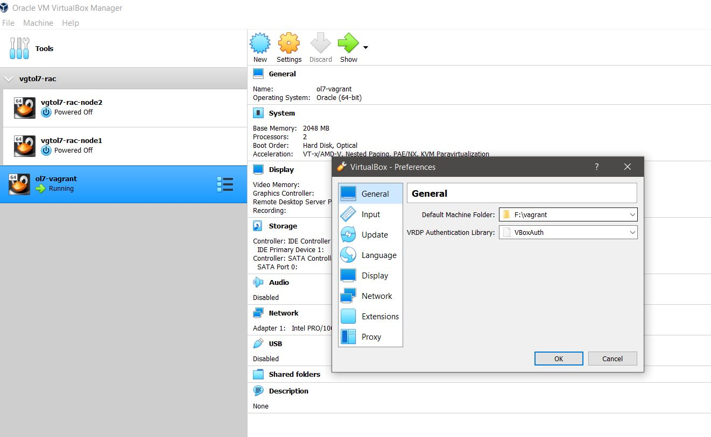

# Procedimentos de contingência e alta disponiblidade

O objetivo deste repositório é apresentar técnicas de contigência e alta disponibilidade. Fique a vontade de submeter melhorias em issues ou até copiar o procedimento (apenas mencione a fonte!)

<a name="#top">Menu:</a>

1. [ Pré-requisitos ](#1)
2. [ Configurações básicas ](#2)
3. [ Vagrant ](#3)
4. [ Load Balancer ](#4)
5. [ LAMP ](#5)
6. [ Oracle Database: Backup, Restore e outras técnicas ](#6)
7. [ Oracle Database: Data Guard ](#7)
8. [ Oracle Database: RAC ](#8)
9. [ Microservices, Serveless ](#9)
10. [ Cloud ](#9)


<a name="1"></a>
# 1. Pré-requisitos

Para realização desta atividade, você precisará de acesso a internet (de preferencia em um computador sem VPN ou proxy - faremos muitos downloads via internet durante a montagem de máquinas virtuais - caso for o caso - ou acesso a cloud) e um computador:

## Sistema Operacional:
- Windows
- Linux
- MacOS

## Infraestrutura:
Depende da atividade escolhida:
- Cluster Oracle RAC: 150 GB espaço livre em disco (ideal, contando download dos binários). Minimo de 16 Gb de RAM para este laboratório.

## Downloads
Para esta atividade utilizaremos o Virtualbox como virtualizador e o Vagrant como orquestrador. Estes downloads deverão ser realizados respectivamentes no seu computador origem.

Link para download: [Virtualbox](https://www.virtualbox.org/wiki/Downloads "VirtualBox - Download")
[Vagrant](https://www.vagrantup.com/downloads "Vagrant - Download")
[Opcional: GIT](https://git-scm.com/book/en/v2/Getting-Started-Installing-Git "Git - Download")

Caso você não faça o download do GIT, baixe o repositório base oficial da Oracle: https://github.com/oracle/vagrant-projects
Um exemplo de como voê pode baixar a partir do seu navegador:


Além disso para as atividades que vamso realizar nos próximos pontos, faça o download dos binários para fazer executar o passo a passo que você irá executar (aqui descreverei os links de referência mas o download deve ser apropriado para o Sistema operacional das suas máquinas virtuais:

- [Oracle Database](https://www.oracle.com/database/technologies/oracle-database-software-downloads.html "Oracle Database - Download"): Caso você queira fazer a tarefa para procedimentos de banco de dados Oracle
- [hammerDB](https://hammerdb.com/download.html "HammerDB - Download"): Para teste de carga.

## Instalação
Deverá ser instalado apenas o que for da sua máquina hospedeira (onde ficarão as VMs), ou seja:

- Virtualbox

- Vagrant

- (Opcional) Git. Caso não queira fazer a instalação do GIT, você pode fazer o download do repositório somente

Os demais binários baixados estarão presentes nas máquinas virtuais criadas.

<!-- blank line -->
----
<!-- blank line -->

[ Retornar para o menu ](#top)

<a name="2"></a>
# 2. Configurações básicas

a) Realize o clone do repositório ou descompacte o download do repositório do git (passo 1 tem uma imagem como fazer download).
comando para clonar caso tenha instalado o git:
git clone https://github.com/oracle/vagrant-projects

Obs. faça o download ou clone do repositório.

b) O próximo passo é para ir ao diretório de cada uma das atividades. Antes de começar quaisquer atividade será mencionado o diretório que você deverá ir. Apenas para a primeira atividade de ambientação do vagrant criaremos uma infraestrutura basica com alguns conceitos.

c) (opcional) caso você deseje alterar as configurações básicas do Virtualbox:


Como área padrão para criação de vms, dentro do Virtualbox:



<!-- blank line -->
----
<!-- blank line -->

[ Retornar para o menu ](#top)

<a name="3"></a>
# 3. Vagrant

Aqui deixo uma referência de comandos básicos de vagrant. Estes comandos são executados no prompt de comando de sua preferencia (ms-dos, powershell, WSL, prompt de comando do MacOS, etc).

. Caso queira se aprofundar, utilize o link: [Vagrant-Documentação Oficial](https://www.vagrantup.com/docs "Vagrant - Documentação oficial")

Comando a ser utilizado no prompt | Utilidade
------------ | -------------
vagrant init | inicializa processos do vagrant no sistema operacional hospedeiro. Deve ser utilizado apenas na primeira instalação
vagrant up | executa código para criação das suas VMs ou inicia sua infra-estrutura, caso ela esteja criada
vagrant destroy | apaga todas suas VMs contidas no código que foi executado
vagrant halt | realiza o desligamento de toda a sua infraestrutura provisionada como código.
vagrant ssh | para acessar a máquina virtual. Pode ser combinada com o nome do servidor, exemplo: vagrant ssh ol7-vagrant (observação se na sua máquina hospedeira você utiliza windows, utilize "set VAGRANT_PREFER_SYSTEM_BIN=0" antes do comando vagrant ssh para forçar a utilização de ssh, nao rsync)
vagrant plugin install | para instalação de plugins no vagrant 

Após a instalação do Vagrant é interessante baixar o pack de extensão de servidores guest do VirtualBox, assim suas máquinas virtuais já estarão com as boas práticas aplicadas:
```
vagrant plugin install vagrant-vbguest
```
Além disso, em todas as atividades onde o Vagrant for utilizado adicione a linha abaixo no Vagrantfile. Essa linha adicionará a sua máquina virtual um device optico para utilizar a iso da pack de extensão do Virtualbox:

```
## add optical Driver
  config.vm.provider "virtualbox" do |vb|
     
  vb.customize ["storageattach", :id, 
                "--storagectl", "IDE Controller", 
                "--port", "0", "--device", "1", 
                "--type", "dvddrive", 
                "--medium", "emptydrive"]    
  end  

```


<!-- blank line -->
----
<!-- blank line -->

[ Retornar para o menu ](#top)

<a name="4"></a>
# 4. Load Balancer
Nesta atividade criaremos todas as instancias de load balancer manualmente com intuito de se ambientar com o vagrant e o conceito de load balancer. Iremos utilizar o software opensource chamado HaProxy que será instalado dentro das máquinas virtuais. Para saber mais sobre o HAProxy, visite o site [HAProxy-Documentação Oficial](http://www.haproxy.org/ "HAProxy - site oficial")

No vagrant o principal arquivo é o vagrantfile que conterá os comandos da infraestrutura que você deseja provisionar.

Nesta atividade executaremos uma atividade semelhante a sugerida no site [Referencia](https://medium.com/@deryrahman/haproxy-load-balancer-with-vagrant-5820a6eb8d06 "HAProxy - site oficial") e abaixo:


a) crie um diretório que hospederá o código da sua infraestrutura com um arquivo chamado vagrantfile
```
tutorial-haproxy
|__ Vagrantfile
```
Obs. os servidores virtuais serão criados no diretório padrão. Caso necessário altere.

b) Adicione o código abaixo ao seu vagrantfile:
```
# vi: set ft=ruby :

n = 2 ## coloque aqui o numero de servidores que você terá de loadbalancer

Vagrant.configure("2") do |config|

  config.vm.define "loadbalancer" do |loadbalancer|
    loadbalancer.vm.box = 'ubuntu/bionic64'
    loadbalancer.vm.hostname = "loadbalancer"
    loadbalancer.vm.network :private_network, ip: "192.168.10.10"
    loadbalancer.vm.network "forwarded_port", guest: 80, host: 3000
    loadbalancer.vm.network "forwarded_port", guest: 8404, host: 8404
  end
  
  config.vm.provider "virtualbox" do |vb|
     vb.customize ["storageattach", :id, 
                "--storagectl", "IDE Controller", 
                "--port", "0", "--device", "1", 
                "--type", "dvddrive", 
                "--medium", "emptydrive"]    
  end  

  n.times do |i|
    config.vm.define "app-#{i+1}" do |app|
      app.vm.box = 'deryrahman/rails-minimal'
      app.vm.hostname = "app-#{i+1}"
      app.vm.network :private_network, ip: "192.168.10.#{10+i+1}"
    end
  end
end
```

Execute o "vagrant up" dentro do diretório com o vagrant file.

Neste momento serão criados 4 servidores.


<!-- blank line -->
----
<!-- blank line -->

[ Retornar para o menu ](#top)

<a name="5"></a>
# 5. LAMP

O objetivo desta atividade é provisionar um ambiente com LAMP e realizar alguns backups da camada de aplicação e banco de dados.

Vá para o diretório da descompactado vagrant-projects/OracleLinux/7 
Run vagrant status to check Vagrantfile status and possible plugin(s) required
Run vagrant up
The first time you run this it will provision everything and may take a while. Ensure you have a good internet connection!
The Vagrant file allows for customization.
SSH into the VM either by using vagrant ssh If required, by Vagrantfile you can also setup ssh port forwarding.
You can shut down the VM via the usual vagrant halt and the start it up again via vagrant up.

<!-- blank line -->
----
<!-- blank line -->

[ Retornar para o menu ](#top)

